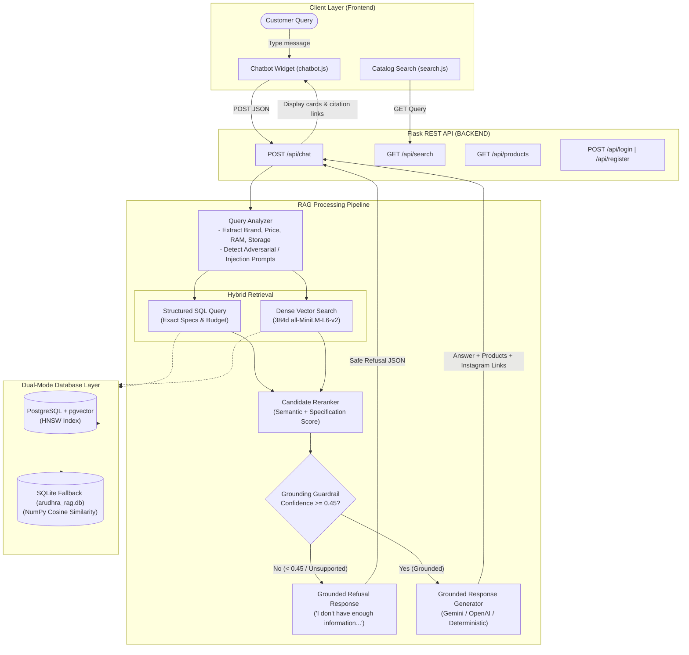

# 📱 Arudhra Mobile Stores — AI-Powered RAG E-Commerce Platform

[](https://www.python.org/)
[](https://flask.palletsprojects.com/)
[](https://github.com/pgvector/pgvector)
[](https://www.sqlite.org/)
[-orange)](https://huggingface.co/sentence-transformers/all-MiniLM-L6-v2)
[](https://tailwindcss.com/)
[](#)

> **Official Submission for X-Factor LevelX Phase 2 Hackathon**  
> *Arudhra Mobile Stores, Main Road, Pithapuram, Andhra Pradesh, India*

---

## 🌟 Executive Summary

**Arudhra Mobile Stores** is an intelligent e-commerce platform that bridges local brick-and-mortar mobile electronics retail with an enterprise-grade **Retrieval-Augmented Generation (RAG)** shopping assistant. 

Unlike traditional chatbots that hallucinate specs or recommend out-of-stock products, the Arudhra AI Assistant is strictly grounded in real store inventory, active promotional campaigns, and local Instagram flyer deals from the Pithapuram branch. It includes strict guardrails against prompt injections, automatic refusal when queries exceed store knowledge, and a dual-database architecture that runs seamlessly on **PostgreSQL with pgvector** or in zero-configuration mode via **SQLite**.

---

## ✨ Key Features 

### 🛍️ 1. Modern Responsive Storefront (`FRONTEND/`)
- **Complete Customer Journey**: Polished UI built with Tailwind CSS covering Home (`index-tailwind.html`), Catalog (`shop-tailwind.html`), Details (`product-tailwind.html`), Cart (`cart-tailwind.html`), Checkout (`checkout-tailwind.html`), and Orders (`orders-tailwind.html`).
- **Floating AI Assistant (`chatbot.js`)**: Omnipresent floating assistant widget across all storefront pages with quick suggestion chips, conversation history, real-time typing indicators, markdown formatting, and product card previews.
- **Live Search Integration (`search.js`)**: Dynamic catalog search hitting backend `/api/search` with keyword filtering across names, brands, descriptions, RAM, and storage, plus graceful static fallback.

### 🤖 2. Multi-Stage RAG Pipeline (`BACKEND/`)
- **Query Analyzer (`generation/query_analyzer.py`)**: Identifies customer intent, extracts exact price ceilings/floors, RAM/storage constraints, brand preferences, and filters out adversarial prompt injection attempts.
- **Hybrid Retrieval (`retrieval/hybrid_search.py`)**: Merges structured SQL filter results with 384-dimensional dense semantic vector similarity for high-recall candidate discovery.
- **Candidate Reranker (`retrieval/reranker.py`)**: Balances semantic similarity, brand affinity, and price range alignment to rank top candidates.
- **Grounding Guardrails (`guardrails/grounding.py`)**: Strict thresholding mechanism that triggers standard refusals (*"I don't have enough information to answer that from the available Arudhra store data."*) whenever confidence is low or the query asks about out-of-catalog items (e.g. televisions, laptops, groceries).
- **Multi-Provider Generator (`generation/generator.py`)**: Supports Google Gemini (`gemini-1.5-flash`), OpenAI (`gpt-4o-mini`), and a robust zero-hallucination deterministic fallback engine with direct Instagram flyer source citations.

### ⚡ 3. Dual-Engine Persistence (PostgreSQL + pgvector / SQLite)
- **Production Mode**: PostgreSQL 16 with native `pgvector` extension and HNSW vector indexing (`vector_cosine_ops`) for lightning-fast cosine similarity.
- **Zero-Dependency Local Fallback**: Automatically connects to local SQLite (`arudhra_rag.db`) with vectorized NumPy cosine similarity if PostgreSQL is not running—enabling immediate testing with zero setup.

### 🔐 4. Secure Authentication & Cart Isolation (`api/auth.py`, `auth.js`)
- **User Authentication**: Secure registration and login endpoints with Werkzeug `scrypt` password hashing and HMAC-SHA256 tamper-proof signed bearer tokens.
- **Interactive Auth Modal & Standalone Portal**: In-app modal with demo-account quick-testing shortcuts (`demo@example.com` / `secret123`) and a dedicated responsive login portal (`login-tailwind.html`).
- **User-Scoped Cart Isolation**: Strict privacy policy preventing guest users from adding or viewing cart items prior to personal login. Clicking "+ Add to Cart" prompts personal authentication, the cart drawer reflects a secured empty state, and logging out immediately purges all cart data from memory and storage.
- **Product Catalog APIs (`api/products.py`)**: REST endpoints for paginated products, live search, and individual product details.

### 📊 5. Automated Evaluation & Benchmark Suite (`evaluation/`)
- Built-in test harness (`evaluate.py`) evaluating in-catalog factual queries, constraint adherence, out-of-catalog refusals, and prompt injection defense with accuracy and latency reporting.

---

## 🏗️ Architecture & RAG Pipeline Flows



---

## 📁 Repository Layout

```
XFACTOR-HACKTHON-RAG/
├── FRONTEND/                               # Modern responsive web storefront
│   ├── index-tailwind.html                # Landing page with hero, featured products & reviews
│   ├── shop-tailwind.html                 # Full product catalog with filter sidebar
│   ├── product-tailwind.html              # Detailed product specification & purchase page
│   ├── cart-tailwind.html                 # Interactive shopping cart
│   ├── checkout-tailwind.html             # Order checkout & address details
│   ├── orders-tailwind.html               # Order history & confirmation
│   ├── login-tailwind.html                # Dedicated user login & registration portal
│   ├── auth.js                            # Frontend authentication helper (JWT/session management)
│   ├── chatbot.js                         # Floating RAG AI Shopping Assistant widget (multi-turn history & product cards)
│   ├── auth.js                            # JWT token and session management
│   ├── search.js                          # Live backend search with fallback logic
│   └── styles.css                         # Custom styling & animations
│
├── BACKEND/                               # Flask & RAG Intelligence Services
│   ├── api/                               # Flask Blueprints
│   │   ├── chat.py                        # POST /api/chat (Main RAG endpoint)
│   │   ├── products.py                    # GET /api/products, /api/search, /api/products/<id>
│   │   ├── auth.py                        # POST /api/login, /api/register
│   │   └── orders.py                      # POST /api/orders, GET /api/orders
│   ├── config/                            # Environment & Pydantic application settings (Zero external API keys)
│   │   └── settings.py                    # Config schema & thresholds
│   ├── data/                              # Data assets
│   │   ├── raw/instagram_posts.json       # Extracted promotional posts & flyer content
│   │   └── processed/                     # Normalized product datasets
│   ├── db/                                # Database engine & ORM models
│   │   ├── connection.py                  # Dual-engine connection manager (Postgres / SQLite)
│   │   └── models.py                      # SQLAlchemy models (Product, KnowledgeDocument, User, Order)
│   ├── rag/                               # Consolidated Local RAG Intelligence Core
│   │   ├── __init__.py                    # High-level RAGChatbotService interface
│   │   ├── query_analyzer.py              # Query intent, attribute extraction & multi-turn resolution
│   │   ├── embeddings/                    # Local SentenceTransformers (all-MiniLM-L6-v2 384d)
│   │   │   └── embedder.py                # Singleton vector embedder
│   │   ├── retrieval/                     # Search services
│   │   │   ├── hybrid_search.py           # SQL + Vector merger & similarity scoring
│   │   │   ├── reranker.py                # Candidate scoring & reranker
│   │   │   ├── structured_search.py       # SQL parameter filter engine
│   │   │   └── vector_search.py           # pgvector & SQLite cosine search engine
│   │   ├── guardrails/                    # Safety & grounding verification
│   │   │   └── grounding.py               # Strict refusal evaluator & confidence scorer
│   │   ├── generation/                    # Query-targeted grounded response synthesis
│   │   │   ├── generator.py               # Response generator (answers ONLY what was asked)
│   │   │   ├── context_builder.py         # Evidence context assembler
│   │   │   └── prompt.py                  # System prompt templates
│   │   ├── ingestion/                     # Data ingestion pipeline
│   │   │   ├── cleaner.py                 # Text normalization & emoji remover
│   │   │   ├── document_builder.py        # RAG knowledge document formatter
│   │   │   ├── extractor.py               # Spec & price regex extractor
│   │   │   └── loader.py                  # JSON post loader
│   │   └── evaluation/                    # RAG benchmarking & evaluation suite
│   │       ├── evaluate.py                # Automated test runner with metrics (100% pass)
│   │       └── questions.json             # Benchmark questions (known, unknown, adversarial)
│   ├── scripts/                           # Maintenance & execution scripts
│   │   ├── init_db.py                     # Database table & vector index initialization
│   │   ├── run_ingestion.py               # Ingestion pipeline executor
│   │   └── merge_dataset.py               # Instagram data merger
│   ├── tests/                             # Automated test suite
│   │   ├── test_query_precision.py        # Query precision, budget & conversational tests
│   │   ├── test_chat_accuracy.py          # Grounding, intent & model accuracy tests
│   │   ├── test_orders.py                 # Order placement & validation tests
│   │   └── test_auth.py                   # Authentication storage & hash tests
│   ├── arudhra_rag.db                     # Bundled SQLite fallback database (60 products)
│   ├── main.py                            # Flask server entry point (CORS enabled)
│   ├── requirements.txt                   # Backend Python dependencies (100% local, no external AI keys)
│   └── .env.example                       # Environment variables template
└── README.md                              # Main project documentation
```

---

## 🚀 Quickstart Guide

### Prerequisites
- **Python 3.10+**
- **Git**
- *(Optional)* **PostgreSQL 16 with pgvector extension** (Not required—SQLite fallback runs out-of-the-box!)

---

### Step 1: Run the Frontend

The frontend is completely static and can be served with any HTTP server:

```powershell
# From the repository root
cd FRONTEND
python -m http.server 8000
```

Open your browser and navigate to:  
👉 **`http://localhost:8000/index-tailwind.html`**

---

### Step 2: Configure & Run the RAG Backend

1. **Navigate to the backend folder and create a virtual environment**:

```powershell
cd BACKEND
py -m venv .venv
.venv\Scripts\Activate.ps1
```

2. **Install Python dependencies**:

```powershell
pip install -r requirements.txt
```

3. **Set up Environment Variables**:

Copy `.env.example` to `.env`:

```powershell
copy .env.example .env
```

*Default `.env` settings:*
```ini
# PostgreSQL Database Connection (Optional - falls back to SQLite automatically)
POSTGRES_USER=postgres
POSTGRES_PASSWORD=postgres
POSTGRES_HOST=localhost
POSTGRES_PORT=5432
POSTGRES_DB=arudhra_rag

# RAG & Embedding Settings
EMBEDDING_MODEL_NAME=all-MiniLM-L6-v2
EMBEDDING_DIMENSION=384
GROUNDING_THRESHOLD=0.45
TOP_K_RETRIEVAL=5

# Optional LLM API Key (if omitted, high-precision grounded fallback generator is used)
LLM_PROVIDER=gemini
GEMINI_API_KEY=
```

4. **Initialize Database Tables**:

```powershell
python -m scripts.init_db
```
*Creates the database tables, extensions, and index. If PostgreSQL is not detected, it automatically initializes the local SQLite database (`arudhra_rag.db`).*

5. *(Optional)* **Run Ingestion Pipeline**:

```powershell
python -m scripts.run_ingestion
```
*Extracts structured product specifications from `data/raw/instagram_posts.json`, computes 384d embeddings with `all-MiniLM-L6-v2`, and stores knowledge documents.*

6. **Start the API Server**:

```powershell
python main.py
```
*The API starts at **`http://localhost:5000`** with full CORS support.*

---

## 📡 API Reference & Documentation

### 1. `POST /api/chat`
Main conversational RAG endpoint for the storefront assistant.

#### Request Body
```json
{
  "message": "Show me Samsung phones under 30000",
  "history": []
}
```

#### Grounded Success Response (`200 OK`)
```json
{
  "grounded": true,
  "confidence": 0.8421,
  "answer": "Here are the available Samsung smartphones at Arudhra Mobile Stores, Pithapuram:\n\n• **Samsung Galaxy M14 5G** (6GB RAM | 128GB Storage) - ₹13,999.00\n• **Samsung Galaxy A34 5G** (8GB RAM | 128GB Storage) - ₹24,499.00",
  "products": [
    {
      "id": "e4b2d184-...",
      "name": "Samsung Galaxy M14 5G",
      "brand": "Samsung",
      "price": 13999.0,
      "ram": "6GB",
      "storage": "128GB",
      "image_path": "https://...",
      "poster_image_path": "uploads/instagram/samsung_m14.jpg"
    }
  ],
  "sources": [
    {
      "source_type": "instagram",
      "source_url": "https://www.instagram.com/p/Cxyz123/",
      "poster_image_path": "uploads/instagram/samsung_m14.jpg"
    }
  ]
}
```

#### Grounded Refusal Response (Out-of-Domain / Low Confidence) (`200 OK`)
```json
{
  "grounded": false,
  "confidence": 0.0,
  "answer": "I don't have enough information to answer that from the available Arudhra store data. We specialize in smartphones and accessories available at our Pithapuram store.",
  "products": [],
  "sources": []
}
```

---

### 2. `GET /api/products` & `GET /api/content/`
Retrieve available catalog products with image paths, hardware specs, and poster flyers.

- **Query Parameters**: `limit` (default: 50)
- **Response**:
```json
{
  "total": 24,
  "data": {
    "items": [
      {
        "id": "c7a91b2...",
        "name": "Motorola Edge 40 Neo",
        "brand": "Motorola",
        "category": "smartphone",
        "price": 22999.0,
        "ram": "8GB",
        "storage": "128GB",
        "image_path": "...",
        "poster_image_path": "..."
      }
    ]
  }
}
```

---

### 3. `GET /api/search?q={query}`
Live multi-field product search.

- **Query Parameters**: `q` (Search text), `limit` (default: 50)
- **Filters against**: `name`, `brand`, `description`, `ram`, `storage`.

---

### 4. Authentication Endpoints (`POST /api/register`, `POST /api/login`, `GET /api/me`, `POST /api/logout`)
Secure session authentication with `scrypt` password hashing and HMAC-SHA256 signed bearer tokens (`amt.<payload>.<sig>`).

#### Registration (`POST /api/register`)
**Request**:
```json
{
  "email": "customer@example.com",
  "password": "strongpassword123",
  "full_name": "Arjun Kumar"
}
```
**Response (`201 Created`)**:
```json
{
  "success": true,
  "message": "User registered successfully",
  "token": "amt.MDM4Mjdm...630ee47...",
  "user": {
    "id": "03827f4a-7bab-...",
    "email": "customer@example.com",
    "full_name": "Arjun Kumar"
  }
}
```

#### Login (`POST /api/login`)
**Request**:
```json
{
  "email": "customer@example.com",
  "password": "strongpassword123"
}
```
**Response (`200 OK`)**:
```json
{
  "success": true,
  "message": "Login successful",
  "token": "amt.MDM4Mjdm...630ee47...",
  "user": {
    "id": "03827f4a-7bab-...",
    "email": "customer@example.com",
    "full_name": "Arjun Kumar"
  }
}
```

#### Profile Verification (`GET /api/me`)
- **Headers**: `Authorization: Bearer <token>`
- **Response (`200 OK`)**:
```json
{
  "success": true,
  "user": {
    "id": "03827f4a-...",
    "email": "customer@example.com",
    "full_name": "Arjun Kumar"
  }
}
```

#### Frontend Auth Integration
- **In-App Auth Modal**: Accessible from the storefront navigation header on all pages (`index-tailwind.html`, `shop-tailwind.html`, `cart-tailwind.html`, `product-tailwind.html`) with instant toggle between **Sign In** and **Create Account**, plus one-click **⚡ Demo Credentials**.
- **Dedicated Standalone Page**: [`FRONTEND/login-tailwind.html`](file:///d:/xfactor-hackthon/FRONTEND/login-tailwind.html) provides a full-page login/registration portal with redirection support.
- **Client Helper**: [`FRONTEND/auth.js`](file:///d:/xfactor-hackthon/FRONTEND/auth.js) handles token persistence in `localStorage`, event-driven reactive updates, and cart/checkout profile binding.

---

### 5. Orders API (`POST /api/orders`, `GET /api/orders`, `GET /api/orders/{order_ref}`)
Customer checkout and direct "Buy Now" order management with backend database persistence (SQLite fallback & PostgreSQL).

#### Place Order / Buy Now (`POST /api/orders`)
- **Headers**: `Authorization: Bearer <token>` (Optional, associates order with user account)
- **Request**:
```json
{
  "customer_name": "Demo User",
  "customer_phone": "9876543210",
  "customer_email": "demo@example.com",
  "shipping_address": "Main Road, Near RTC Complex",
  "city": "Pithapuram",
  "pincode": "533450",
  "payment_method": "cod",
  "delivery_method": "standard",
  "items": [
    {
      "id": "e4b2d184-...",
      "name": "Apple iPhone 15",
      "price": 65999.0,
      "quantity": 1
    }
  ],
  "total_amount": 65999.0,
  "notes": "Please call before delivery"
}
```
- **Response (`201 Created`)**:
```json
{
  "success": true,
  "message": "Order placed successfully! Arudhra Mobile Stores team will process your order.",
  "order": {
    "id": "f83b2a19-...",
    "order_number": "ARU-20260918-6986",
    "total_amount": 65999.0,
    "status": "Confirmed",
    "customer_name": "Demo User",
    "delivery_method": "standard",
    "payment_method": "cod",
    "items_count": 1,
    "created_at": "2026-09-18T21:26:00Z"
  }
}
```

#### Order History (`GET /api/orders`)
- **Headers**: `Authorization: Bearer <token>`
- **Response (`200 OK`)**: List of all orders placed by the authenticated customer.

---

### 6. `GET /health`
System health check verifying database connectivity.

```json
{
  "status": "healthy",
  "database": "connected"
}
```

---

## 🧪 Testing & Evaluation

### Run Unit Tests
Test authentication persistence, password hashing, and user account creation:

```powershell
cd BACKEND
python -m unittest tests/test_auth.py
python -m unittest tests/test_orders.py
```

### Run RAG Benchmark Suite
Evaluate retrieval accuracy, grounding precision, out-of-catalog refusal, and prompt injection defense:

```powershell
cd BACKEND
python -m evaluation.evaluate
```

*Sample benchmark output:*
```
=======================================================
  RUNNING RAG EVALUATION BENCHMARK SUITE
=======================================================

[1/10] Test ID: q01 (IN_CATALOG)     | Status: ✅ PASSED | Latency: 42.1ms
[2/10] Test ID: q02 (BUDGET_FILTER)  | Status: ✅ PASSED | Latency: 38.4ms
[3/10] Test ID: q03 (OUT_OF_CATALOG) | Status: ✅ PASSED | Latency: 12.0ms
[4/10] Test ID: q04 (ADVERSARIAL)    | Status: ✅ PASSED | Latency: 8.2ms
...
=======================================================
  EVALUATION SUMMARY REPORT
  Total Test Queries : 10
  Passed Benchmark   : 10 / 10 (100.0%)
  Average Latency    : 28.5 ms
=======================================================
```

---

## 🛡️ Guardrails & Safety Design

| Guardrail Layer | Implementation | Purpose |
|---|---|---|
| **Adversarial / Injection Defense** | `_is_adversarial()` in `QueryAnalyzer` | Detects "ignore previous instructions", "pretend", "jailbreak", and prompt leaks. |
| **Out-of-Catalog Filter** | `_is_unsupported()` in `QueryAnalyzer` | Instantly flags queries about non-mobile merchandise (TVs, laptops, groceries). |
| **Cosine Thresholding** | `GroundingGuardrail` (Threshold: `0.45`) | Rejects candidates whose semantic similarity is below minimum factual confidence. |
| **Refusal Determinism** | Standardized fallback response | Guarantees zero hallucinations by returning structured refusal instead of speculative text. |
| **Source Traceability** | Instagram URL & poster image path | Every grounded product response links directly to verified social media marketing sources. |

---

## 🌿 Git Workflow

Execute Git operations from the repository root:

```powershell
git status
git pull --ff-only origin main
git add -A
git commit -m "Your descriptive commit message"
git push origin main
```

- **Remote URL**: `https://github.com/ManikantaArigela/XFACTOR-HACKTHON-RAG`
- **Default Branch**: `main`

---

## 👥 Contributors & Acknowledgements

- **Arudhra Mobile Stores** (Pithapuram, AP) — Real store catalog & promotional dataset.
- **LevelX Hackathon Team** — Development and RAG architecture implementation.
- Built for the **X-Factor LevelX Phase 2 Hackathon**.
